# Microservices Architecture

Microservices Architectureの実証実験プロジェクト。

Typescript言語でマイクロサービスを構築するために有効なライブラリとして、[NestJS](https://nestjs.com)があります。NestJSを使用してマイクロサービスを構築する[公式ドキュメント](https://docs.nestjs.com/microservices/basics)があります。
NestJSを使用したREST APIは実装したことがあるのですが、マイクロサービスではTCPトランスポートレイヤーやgRPCトランスポートレイヤーを使用しての通信であるため、REST APIとは実装が異なります。公式ドキュメントは断片的な記述しかないため、わかりづらいと感じました。しかもTCPトランスポートレイヤーよりgRPCトランスポートレイヤーの場合は、説明がより少なく、TCPトランスポートレイヤーより複雑だと思います。TCPトランスポートレイヤーの説明ではメッセージベース(リクエスト・レスポンス)とイベントベースの両方の説明がありますが、gRPCの説明ではメッセージベースの説明しかないため、イベントベースの実装が不可能なのかもしれません。
NestJSのマイクロサービスでgRPCトランスポートレイヤーに関する日本語の情報が少ないため、サンプルアプリケーションを作成して、技術のキャッチアップを行います。
最終的にはストリーミング(サーバーサイド、クライアントサイド、双方向)の検証ができればいいと考えています。

## 環境構築

ここで説明している環境のバージョンは以下の通りです。

- Debian bookworm
- NodeJS 20
- NestJS 10

Node.JSがインストールされていることが前提です。
NestJSのクライアントツールをインストールします。

```shell
npm install -g @nestjs/cli
```

ディレクトリ構成は以下のようにします。

```shell
.
├── backend/
│   ├── user-service
│   ├── email-service
│   └── api-gateway
├── frontend
└── lib
```

backendフォルダーにAPI Gateway、User Service、Email Serviceを配置します。全てのパッケージマネージャーはyarnを使用します。

## ユースケース

マイクロサービスアーキテクチャでは、複数のサービスを連携させてユースケースを遂行します。
Typescript言語を使用する予定であるため、NestJSを使用して全てのサービスを構築します。
マイクロサービスの実証のために、TCPトランスポートレイヤーを使用した[NestJSのMicroservices機能を使ってマイクロサービスアーキテクチャのサンプルアプリケーションを実装する](https://zenn.dev/logbuild/articles/88a7002df0454d)を参考に、以下のユーズケースを実装します。

- ユーザーを新規登録する
- ユーザーリストを取得する
- メール履歴を取得する

これらのユースケースを実装するためにユーザーのマイクロサービスとEmailのマイクロサービスを用意します。

フロントエンドからはAPIを通してユースケースを実行します。API GatewayへはHTTPで通信を行います。
API Gatewayとマイクロサービス、マイクロサービス間のトランスポートレイヤーはgRPCで通信を行います。


モノレポ構成にするので、ルートディレクトリにpackage.jsonを作成します。

./package.json

```json
{
  "name": "microservice",
  "version": "0.1.0",
  "description": "Microservices Architectureの実装検証プロジェクト",
  "main": "index.js",
  "repository": "https://github.com/masakazu1967/microsoft.git",
  "author": "Masakazu Kobayashi <masakazu1967@yggdrasilroot.info>",
  "license": "MIT",
  "private": true,
  "scripts": {
  },
  "workspaces": [
    "frontend/*",
    "backend/*",
    "lib/*"
  ]
}
```

User Serviceのユーザーリストを取得するを実装するために、User Serviceアプリケーションを作成します。

```shell
cd backend
nest new user-service
cd ..
```

作成したuser-serviceのpackage.jsonのnameをuser-serviceから@microservice/user-serviceに変更します。

./backend/user-service/package.json

```json
{
  "name": "user-service",
  "version": "0.0.1",
  ...
}
```

を

```json
{
  "name": "@microservice/user-service",
  "version": "0.0.1",
  ...
}
```

に変更します。

NestJSのmicroservices OverviewとgRPCのInstallationに記述のパッケージをインストールします。

```shell
yarn workspace @microservice/user-service add @nestjs/microservices @grpc/grpc-js @grpc/proto-loader
```

またプロトコルバッファのコンパイラと、.protoファイルからインターフェイスファイルを作成するためのツールをインストールします。

```shell
sudo apt install -y protobuf-compiler
yarn workspace @microservice/user-service add -D ts-proto
```

`User`のモジュール、コントローラ、サービスを自動作成します。

```shell
cd backend/user-service
nest g controller user
nest g module user
nest g service user
cd ../../
```

.protoファイルをビルドしてできたdistフォルダに配置するために`assets`に.protoファイルを追加して`watchAssets`を`true`にします。

./backend/user-service/nest-cli.json

```json
{
  "$schema": "https://json.schemastore.org/nest-cli",
  "collection": "@nestjs/schematics",
  "sourceRoot": "src",
  "compilerOptions": {
    "assets": ["**/*.proto"],
    "watchAssets": true,
    "deleteOutDir": true
  }
}
```

あくまでMSAの実証検証のためなので、データベースへのアクセスなどは考えず、インメモリーでの保存の実装を行います。
実際のメール送信も本質的な問題ではないため、実装は見送ります。

API Gatewayのユーザーリストを取得するを実装するために、API Gatewayアプリケーションを作成します。

```shell
cd backend
nest new api-gateway
cd ..
```

作成したapi-gatewayのpackage.jsonのnameをapi-gatewayから@microsoft/api-gatewayに変更します。

./backend/api-gateway/package.json

```json
{
  "name": "api-gateway",
  "version": "0.0.1",
  ...
}
```

を

```json
{
  "name": "@microservice/api-gateway",
  "version": "0.0.1",
  ...
}
```

に変更します。

NestJSのmicroservices OverviewとgRPCのInstallationに記述のパッケージをインストールします。

```shell
yarn workspace @microservice/api-gateway add @nestjs/microservices @grpc/grpc-js @grpc/proto-loader
```

## ドメイン


まずはUser Serviceを作成するため、User Serviceのprotoファイルを作成します。

./backend/user-service/src/user/user.proto

```proto
syntax = "proto3";

package user;

import "google/protobuf/empty.proto";

service UserService {
  rpc FindAll (google.protobuf.Empty) returns (UserReply) {}
}

message UserReply {
  repeated User users = 1;
}

message User {
  int32 id = 1;
  string email = 2;
  string name = 3;
}
```

戻り値としてUserの配列を返すが、protoでUserの配列を返す方法がわからず、`returns (repeated User) {}`とすればいいかもしれないが、そのような例が見当たらなかったので、一旦`User`の配列だけを要素にもつ`UserReply`を用意し、それを戻り値の型として指定しました。
あとメソッドに引数が不要な場合、引数を空で指定`rpc FindAll () returns (UserReply) {}`すると`Except type name`というエラーが発生し、ファイルができませんでした。

```proto
message UserReply {
  repeated User users = 1;
}
```

```proto
  rpc FindAll (google.protobuf.Emtpty) returns (UserReply) {}
```

空を表す`google.protobuf.Empty`を指定します。

このprotoファイルからUser.tsを生成します。

```shell
cd backend/user-service
protoc --ts_proto_opt=nestJs=true --plugin=../../node_modules/.bin/protoc-gen-ts_proto --ts_proto_out=. ./src/user/user.proto
cd ../../
```

NestJSでMicroserviceを構築する場合は、`bootstrap`で`NestFactory`で作成するために`create`ではなく、`createMicroservice`メソッドを使用します。

./backend/user-service/src/main.ts

```ts
async function bootstrap() {
  const app = await NestFactory.createMicroservice<MicroserviceOptions>(
    AppModule,
    {
      transport: Transport.GRPC,
      options: {
        package: 'user',
        protoPath: join(__dirname, 'user/user.proto'),
        url: '0.0.0.0:5001',
      },
    },
  );
  await app.listen();
}
bootstrap();
```

`options`の`url`を指定しないとデフォルトで5000番ポートが使用されます。上記では5001ポートを指定しています。

### ユーザーリストを取得する


「ユーザーリストを取得する」ユースケースでは、API GatewayとUser Serviceに実装が必要であるが、ひとまずUser Serviceを実装する。

User Serviceの「ユーザーリストを取得する」はレスポンスが必要であるため、TCPトランスポートレイヤーの場合はリクエスト・レスポンスの[メッセージパターン](https://docs.nestjs.com/microservices/basics#request-response)を使用します。
gRPCトランスポートレイヤーの場合もリクエスト・レスポンスであるが、メソッドには`@MessagePattern()`デコレータを使用せず、`@GrpcMethod()`デコレータを使用します。

src/user/user.controller.ts

```ts
@Controller()
export class UserController {
  @GrpcMethod('UserService', 'FindAll')
  findAll(): UserReply {
    const users: User[] = [
      { id: 1, email: 'john@example.com', name: 'John' },
      { id: 2, email: 'doe@example.com', name: 'Doe' },
    ];
    return { user: users };
  }
}
```

`findAll`メソッドのリクエスト・レスポンスをgRPCのメソッドに割り当てるために、`@GrpcMethod()`デコレータを使用します。

gRPCのメソッドの先頭を小文字にしたものとコントローラのメソッドが一致する場合は`@GrpcMethod`の第2引数を省略することができます。

```ts
  @GrpcMethod('UserService')
  findAll(): UserReply {
```

user.module.tsの編集

UserControllerをcontrollersに追加します。

./backend/user-service/src/user/user.module.ts

```ts
@Module({
  providers: [UserService],
  controllers: [UserController],
})
export class UserModule {}
```

`nest g`コマンドを実行したことでapp.module.tsに`UserModule`と`UserController`が追加されています。

./backend/user-service/src/app.module.ts

```ts
@Module({
  imports: [UserModule],
  controllers: [AppController, UserController],
  providers: [AppService],
})
export class AppModule {}
```

これでUser Serviceの「ユーザーリストを取得する」が実装できたので、動作を確認してみます。

ルートディレクトリのpackage.jsonの`scripts`に起動のショートカットを追加します。

./package.json

```json
  "scripts": {
    "user-service:start": "yarn workspace @microservice/user-service start",
    "user-service:start:dev": "yarn workspace @microservice/user-service start:dev"
  },
```

ルートディレクトリで開発環境用のユーザーサービスを起動します。

```shell
yarn user-service:start:dev
```

トレースログに以下の警告が表示されました。

```shell
(node:88006) DeprecationWarning: Calling start() is no longer necessary. It can be safely omitted.
(Use `node --trace-deprecation ...` to show where the warning was created)
```

`@grpc/grpc-js`のバージョン1.12.2を使用しています。1.10+からは`server.start()`は必要ないようですが、NestJSで実行しているようです。

`start()`を実行しないように[fix(microservice) Delete unnecessary call of grpcClient.start](https://github.com/nestjs/nest/pull/13283)では修正をマージをしているようでしたが、[fix(microservices): delete unnecessary call of grpcClient.start](https://github.com/nestjs/nest/pull/13468)ではPRはオープンされたままでした。コメントを見ると、breaking changeが発生しそうなのでrevertしたそうです。breaking changeの具体的な内容が記述されていないため、理由を聞いているコメントもありましたが、回答がありませんでした。なので、もしかしたらNestJS10では直らないのかもしれません。

警告なだけなのでこの警告は無視することにします。

gRPCクライアントのevansで検証をします。
evansのインストールはmacは`brew install evans`でOKです。
debianの場合は以下のコマンドでインストールします。

```shell
curl -OL https://github.com/ktr0731/evans/releases/download/v0.10.11/evans_linux_arm64.tar.gz
tar zxvf evans_linux_arm64.tar.gz
sudo mv evans /usr/local/bin
rm evans_linux_arm64.tar.gz
```

evansを起動します。

```shell
cd backend/user-service
evans --host localhost -p 5001 src/user/user.proto
```

接続ができれば以下の画面が表示されます。

```shell

  ______
 |  ____|
 | |__    __   __   __ _   _ __    ___
 |  __|   \ \ / /  / _. | | '_ \  / __|
 | |____   \ V /  | (_| | | | | | \__ \
 |______|   \_/    \__,_| |_| |_| |___/

 more expressive universal gRPC client

 user.UserService@localhost:5001>
```

`show service`でサービスが列挙されます。

```shell
+-------------+---------+--------------+---------------+
|   SERVICE   |   RPC   | REQUEST TYPE | RESPONSE TYPE |
+-------------+---------+--------------+---------------+
| UserService | FindAll | Empty        | UserReply     |
+-------------+---------+--------------+---------------+
```

`call FindAll`で`UserService`の`FindAll`が呼ばれます。

```shell
call FindAll
{
  "users": [
    {
      "email": "john@example.com",
      "id": 1,
      "name": "John"
    },
    {
      "email": "doe@example.com",
      "id": 2,
      "name": "Doe"
    }
  ]
}
```

gRPCでリクエスト・レスポンスの実装ができることが検証できました。続いてAPI Gatewayからユーザーサービスを呼び出してみましょう。

ユーザーサービスのuser.protoとuser.tsをAPI Gatewayのuserフォルダにコピーします。

```shell
.
├── backend/
│   ├── user-service/
│   │   └── src/
│   │       └── user/
│   │           ├── user.proto // このファイルをapi-gateway/src/userにコピー
│   │           └── user.ts // このファイルをapi-gateway/src/userにコピー
│   ├── email-service
│   └── api-gateway/
│       └── src/
│           └── user/
│               ├── user.proto // コピーされたファイル
│               └── user.ts // コピーされたファイル
├── frontend
└── lib
```

API GatewayのAppModuleにクライアントモジュールとしてユーザーサービスを登録します。

./backend/api-gateway/src/app.module.ts

```ts
@Module({
  imports: [
    ClientsModule.register([
      {
        name: 'USER_PACKAGE',
        transport: Transport.GRPC,
        options: {
          package: 'user',
          protoPath: join(__dirname, './user/user.proto'),
          url: process.env.USER_SERVICE_URL || 'localhost:5001',
        },
      },
    ]),
  ],
  controllers: [AppController],
  providers: [AppService],
})
export class AppModule {}
```

登録したクライアントをAppServiceに注入します。

./backend/api-gateway/app.service.ts

```ts
@Injectable()
export class AppService implements OnModuleInit {
  private userService: UserServiceClient;

  constructor(@Inject('USER_PACKAGE') private client: ClientGrpcProxy) {}

  onModuleInit() {
    this.userService = this.client.getService<UserServiceClient>('UserService');
  }

  findAllUsers(): Observable<UserReply> {
    return this.userService.findAll({});
  }
}
```

AppControllerからAppServiceのfindAllUsers()を呼び出します。

./backend/api-gateway/app.controller.ts

```ts
@Controller()
export class AppController {
  constructor(private readonly appService: AppService) {}

  @Get('/users')
  findAllUser(): Observable<UserReply> {
    return this.appService.findAllUsers();
  }
}
```

API Gatewayも.protoファイルをビルドしてできたdistフォルダに配置するために`assets`に.protoファイルを追加して`watchAssets`を`true`にします。

./backend/api-gateway/nest-cli.json

```json
{
  "$schema": "https://json.schemastore.org/nest-cli",
  "collection": "@nestjs/schematics",
  "sourceRoot": "src",
  "compilerOptions": {
    "assets": ["**/*.proto"],
    "watchAssets": true,
    "deleteOutDir": true
  }
}
```

ルートディレクトリのpackage.jsonの`scripts`にAPI Gateway起動のショートカットを追加します。

./package.json

```json
  "scripts": {
    "api-gateway:start": "yarn workspace @microservice/api-gateway start",
    "api-gateway:start:dev": "yarn workspace @microservice/api-gateway start:dev",
    "user-service:start": "yarn workspace @microservice/user-service start",
    "user-service:start:dev": "yarn workspace @microservice/user-service start:dev"
  },
```

ユーザーサービスが立ち上がっている状態で、API Gatewayを起動します。

```shell
yarn api-gateway:start:dev
```

API Gatewayのユーザーリストを取得するAPIを呼び出します。

```shell
curl http://localhost:3000/users
{"users":[{"id":1,"email":"john@example.com","name":"John"},{"id":2,"email":"doe@example.com","name":"Doe"}]}
```

protoファイルと生成されたtsファイルはクライアントとサーバー両方で使用します。
共通な場所に保存するのではなくて、別々に管理します。サーバーの開発中のprotoファイルとクライアントが使用したいprotoファイルは異なる可能性があるからです。

### 「ユーザーを新規登録する」ユースケース


User Serviceの「ユーザーを登録する」とEmail Serviceの「メールを送信する」はレスポンスが不要な[イベントベース](https://docs.nestjs.com/microservices/basics#event-based)のパターンを使用します。

NestJSの[gRPCのドキュメント](https://docs.nestjs.com/microservices/grpc)ではリクエスト・レスポンスであるメッセージパターン(`@MessagePattern()`デコレータの代わりに`@GrpcMethod()`デコレータを使用する)と[マイクロサービス](https://docs.nestjs.com/microservices/basics)の説明では出てこなかった、ストリーミングの説明しか記述されておらず、gRPCでイベントパターンをサポートしているかがわかりませんでした。

### メール履歴を取得する


Email Serviceの「メール履歴を取得する」はレスポンスが必要であるため、リクエスト・レスポンスのメッセージパターンを使用します。

## API


